# 文章结构

Overleaf链接：https://www.overleaf.com/8702087qghmbvdwbzjj

-[ ] 图不全

-[ ] 缺部分参考文献
-[ ] 实验结果

## 1Intro

余

##2 Background
余

##3 System design
余

###3.1 Overview

###3.2 Computation

###3.3 Buffer

###3.4 Control&instructions
## 1Intro
余
## 2 Background
余
## 3 System design
余
### 3.1 Overview
### 3.2 Computation
### 3.3 Buffer
### 3.4 Control&instructions

## 4 Scheduling
### 4.1 Cross layer introduction
余，胡

### 4.2Network split

- [ ] 给我们的图取一个吊炸天的名字

### 4.3compiler design

- 数据排布方案

  - 把BRAM当作一个整体，暂不考虑其内部
  - 资源分配方案
    数据在BRAM与DDR中如何流动
    layer data flow
    对应code/scheduler/kernelsim.py

- 算法资源消耗分析

  - 在本节中提出BRAM内具体的存储结构，循环队列等

  - 每一层要花多少memory，包括features, weights, bias

    与上一节的Check函数相关

    对应code/scheduler/split.py

- 指令调度（七层循环）

  - 具体如何生成指令，对应code/scheduler/inst.py
  - 伪代码
  - ​

## 5 Experiments

余，胡，。。

##6 Related work
妃

## 7 Conclusion

### 4.2 Network split
胡
### 4.3 compiler design
胡
## 5 Experiments
余，胡，。。
## 6 Related work
妃
## 7 Conclusion

汪

# 实验总结

## AXI 总线总结

AXI 总线一共五个通道: 分为两组，WRITE,READ
其中 WRITE 有三个通道： 地址通道 AW, 数据通道 W, 确认共同 Background
READ 通道有两个通道: 地址通道 RW, 数据通道 R

每个通道的关键信号为 VALID, READY。 只有 VALID 和 READY 同时为高时信号才被有效处理。为了防止死锁，VALID 和 READY 没有相互依赖关系，作为发送端，只要数据准备好了就可以将VALID拉高，相应的接收端能够接收信号的时候就可以把READY 信号拉高。

对于读写操作，先通过地址通道发送地址，再通过数据通道传输数据，WRITE操作是有responsed信号（B通道）

图示如下：

读架构

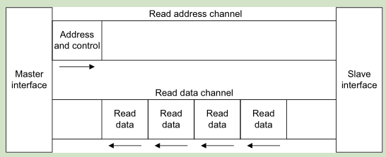

写架构

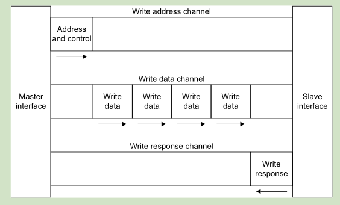

信号描述

表 2-1 全局信号

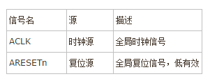

表 2-2 写地址通道信号 

其中lock一般设为0
BURST 设为 2'b01，表示连续突发
axi_awsize 为突发字节数，如：DATA为256bit，对于64字节，axi_awsize = 5（2^(axi_awsize+1) == 64）

axi_len 为单次传输的次数，比如要读 512bit,需要读两次256bit，则 axi_len = 2

axi_awburst <= 0;
axi_awlock <= 0;
axi_awcache <= 0;
axi_awprot <= 0; 就好

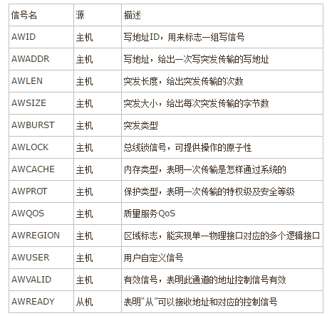

表 2-3 写数据通道信号

ID 基本上都没有设置，没有用到。

***注意：*** WSTRB 默认应该全部设置为高;   assign       axi_wstrb = 32'hffffffff; 以保证传输的数据被写到内存中。

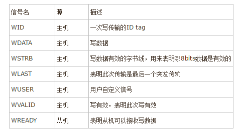

表 2-4 写响应通道信号 

一般没有使用，主机把BREADY 一直置高就好

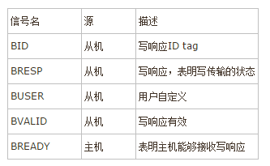

表 2-5 读地址通道信号
读比写操作更加简单。地址通道的操作完全一致

我一般采用读写通道使用相同的 ARSIZE,AWSIZE (一次传输字节数为 : 2^(ASIZE + 1))

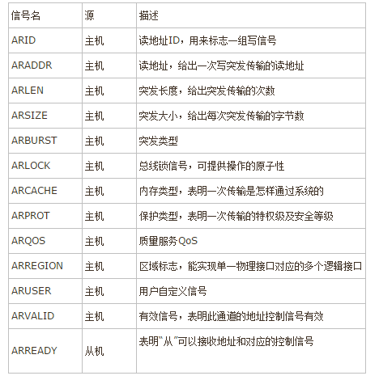

表 2-6 读数据通道信号 

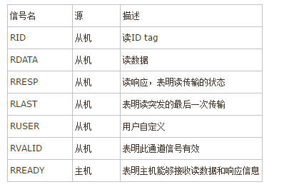

详细的可以参考

[CSDN 博客](http://blog.csdn.net/augus_per/article/details/52682311)

[百度文库1](https://wenku.baidu.com/view/ac32c8bcf705cc1754270923.html)

[百度文库2](https://wenku.baidu.com/view/e42b2ac8f90f76c660371a3c.html)

## PCIE

PCIE 使用xilinx 官方IP 以及配套的驱动程序。

驱动程序下载:

[xilinx wiki AR#65444](https://www.xilinx.com/support/answers/65444.html)

PCIE 配置：

vivado中 IP 名称为 "DMA/Bridge Subsystem for PCIE Express"

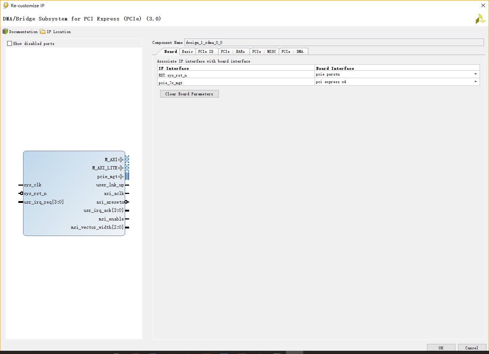

在 basic 选项卡中设置 AXI的位宽频率

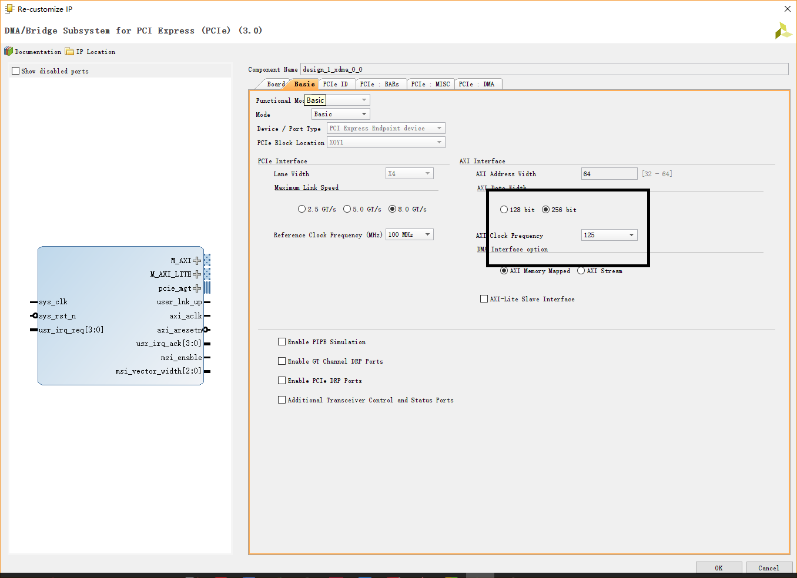

在 PCIE ID 中设置memory control 与 flash 选项

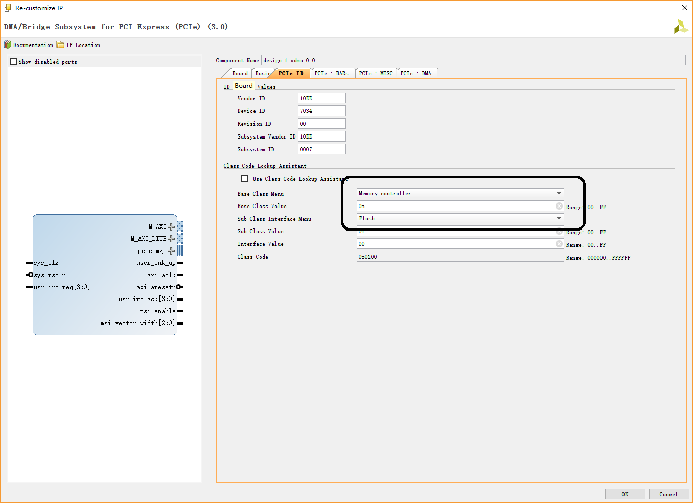

在 PICE Bars 选项卡中设置打开 AXI_LITE 接口，相当于 Zynq的 GP 口

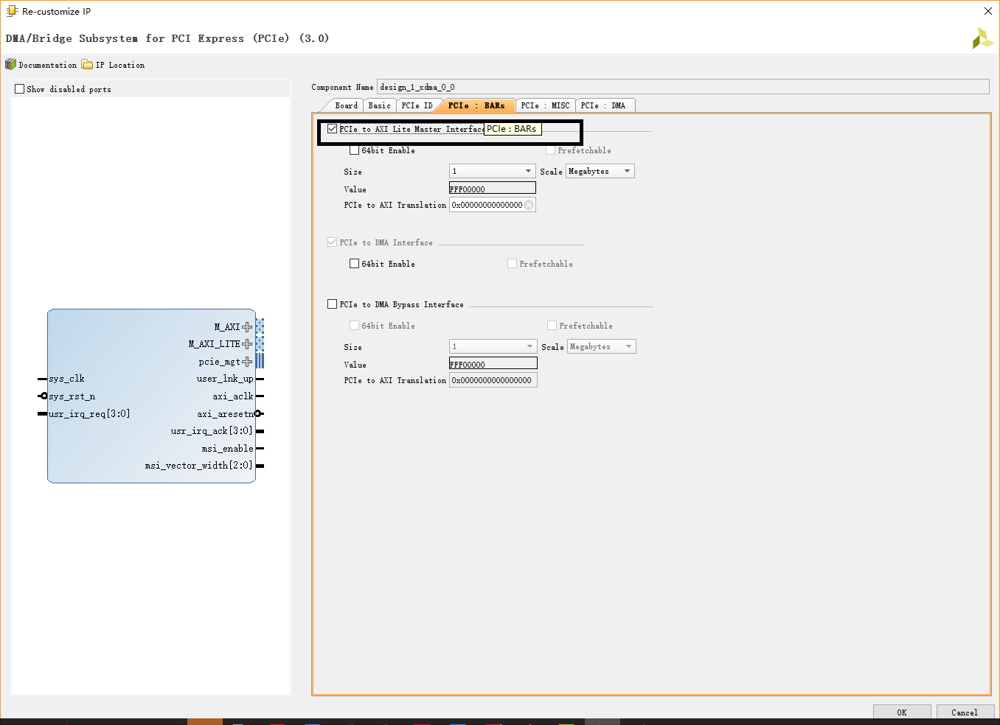

